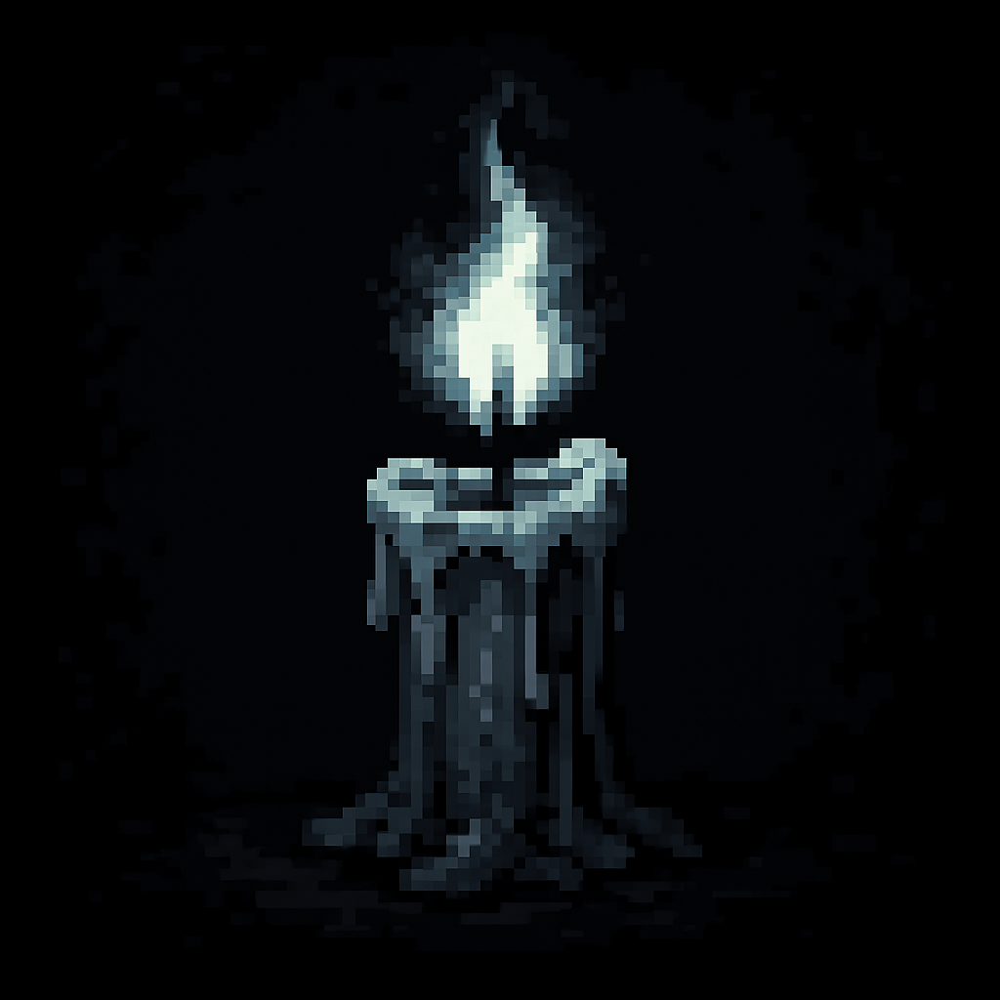

 [](LICENSE)  



# 🕯️ The Last Candle

*"In the darkness, only one candle remains..."*

A psychological horror adventure game built with Java ACM Graphics and ported to HTML5 Canvas. Navigate through a haunted house, make moral choices, and discover one of three possible endings.

## 🎃 Kiroween Hackathon Submission

**Category**: Costume Contest - Haunting User Interface

### 💾 Download & Play

**Windows Users**: [Download the installer from Releases](../../releases/latest) - No Java installation required!

**Other Platforms**: Follow the Quick Start instructions below to run from source.

This game showcases a polished, atmospheric horror UI with:
- Dark, minimalist aesthetic that enhances psychological tension
- Retro pixel art style with custom Press Start K font
- Three distinct ending screens with unique narrative artwork
- Immersive inventory system with visual feedback
- Seamless room transitions and environmental storytelling

## 🎮 Game Overview

You wake up in a dark house with only 3 HP and a flickering candle. As you explore interconnected rooms, you'll encounter:
- **A mysterious NPC** seeking your help
- **A relentless monster** hunting you through the halls
- **Moral choices** that determine your fate
- **Multiple endings** based on your decisions

### Features
- 🏚️ **Three explorable rooms**: Living Room, Bedroom, Office
- 👻 **Psychological horror** atmosphere over jump scares
- 🎒 **Inventory system** with collectible items and weapons
- 🤖 **Monster AI** with pathfinding and collision detection
- 💬 **NPC dialogue** with branching choices
- 🎭 **Three endings**: Good, Bad, and True
- 💾 **Save/Load system** for persistent progress
- 🌐 **Web port** playable in any modern browser

## 🚀 Quick Start

### Option 1: Windows Installer (Recommended)
1. Download the `.exe` installer from [Releases](../../releases/latest)
2. Run the installer and follow the wizard
3. Launch from Start Menu or Desktop shortcut

### Option 2: Java Version (All Platforms)
```bash
# Compile the project
javac -cp acm.jar -d bin src/Boilerplate/*.java src/Entity/*.java src/GamePanes/*.java src/Item/*.java

# Run the game
java -cp "bin;acm.jar" Boilerplate.MainApplication
```

### Option 3: Web Version (Browser)
```bash
# Start a local server
python -m http.server 8000

# Open in browser
# Navigate to http://localhost:8000/web/
```

## 🎯 Controls

- **WASD** or **Arrow Keys**: Move player
- **Mouse**: Click inventory items and menu buttons
- **ESC**: Pause menu (during gameplay)

## 🛠️ Technology Stack


## 🛠️ Built With Kiro

This entire project was developed using Kiro, an AI-powered IDE that partnered with me throughout the development process. Here's how Kiro's features were instrumental:

### 📝 Spec-Driven Development

I used Kiro's spec system to structure the entire game architecture:

**Specs Created**:
- `game-architecture`: Core game engine, entity system, and room management
- `web-port`: HTML5 Canvas translation from Java

The spec-driven approach allowed me to:
1. Define clear requirements and acceptance criteria upfront
2. Break down complex systems into manageable tasks
3. Iterate on design before implementation
4. Track progress with checkboxes (35/35 tasks completed!)

**Example workflow**:
```
Me: "I need a player character with 4-directional movement and animation"
Kiro: *Creates AC-2 in requirements.md with detailed criteria*
Kiro: *Designs Player class with sprite management in design.md*
Kiro: *Breaks implementation into Task 2.2 with file checklist*
Kiro: *Implements Player.java with collision detection and animation*
```

### 🎨 Vibe Coding

For rapid prototyping and creative elements, I used conversational coding:

**Most impressive generations**:
- **Monster AI pathfinding**: Described behavior in plain English, Kiro generated the chase algorithm
- **Inventory UI system**: Sketched the hotbar concept, Kiro implemented the entire visual system
- **Multiple endings logic**: Explained the narrative branches, Kiro wired up the conditional pane switching

**Example conversation**:
```
Me: "The monster should chase the player but move slower, and deal damage on collision"
Kiro: *Generated Monster.move(player) with distance calculation and touchPlayer() collision detection*
```

### 🪝 Agent Hooks

Automated my development workflow with custom hooks:

1. **compile-java.json**: Auto-compiles Java files on save
   - Trigger: `onFileSave` for `src/**/*.java`
   - Catches syntax errors immediately

2. **update-web-port.json**: Reminds me to sync JavaScript when Java entities change
   - Trigger: `onFileSave` for `src/Entity/*.java`
   - Prevents version drift between Java and web

3. **gameplay-session.json**: One-click game launch for playtesting
   - Trigger: Manual button "🎃 Launch Game"
   - Streamlined testing iterations

4. **web-server.json**: Starts local server for web version testing
   - Trigger: Manual button "🌐 Start Web Server"
   - Quick browser testing

5. **asset-optimization.json**: Checks PNG file sizes
   - Trigger: Manual button "🖼️ Check Asset Sizes"
   - Ensures performance targets

6. **pre-commit-test.json**: Runs game tests before commits
   - Trigger: Manual button "🎮 Run Game Tests"
   - Prevents broken builds

### 🧭 Steering Documents

Created custom steering rules to maintain consistency:

1. **java-game-dev-standards.md**: 
   - ACM Graphics patterns and best practices
   - Package structure conventions
   - Collision detection algorithms
   - Performance optimization guidelines

2. **horror-game-design.md**:
   - Psychological horror principles
   - Visual design color palette
   - Pacing and tension mechanics
   - Narrative ambiguity guidelines

These steering docs ensured Kiro understood the project's unique requirements and generated code that fit the horror aesthetic and technical architecture.

## 🎨 Game Design

### Horror Elements
- **Isolation**: Minimal NPCs, player is alone
- **Vulnerability**: Only 3 HP, every hit matters
- **Uncertainty**: Ambiguous narrative, multiple interpretations
- **Minimalism**: Sparse UI increases tension

### Room Layout
```
Living Room (Start) → Bedroom (NPC Choice) → Office (Final Confrontation)
```

### Endings
1. **Good Ending**: Help the NPC, face your fears
2. **Bad Ending**: Refuse to help, suffer consequences
3. **True Ending**: Discover the hidden path (secret!)

## 📁 Project Structure

```
the-last-candle/
├── .kiro/                      # Kiro development artifacts
│   ├── specs/
│   │   ├── game-architecture/  # Core game spec
│   │   │   ├── requirements.md
│   │   │   ├── design.md
│   │   │   └── tasks.md
│   │   └── web-port/           # Web version spec
│   │       ├── requirements.md
│   │       ├── design.md
│   │       └── tasks.md
│   ├── steering/
│   │   ├── java-game-dev-standards.md
│   │   └── horror-game-design.md
│   └── hooks/
│       ├── compile-java.json
│       ├── update-web-port.json
│       ├── gameplay-session.json
│       ├── web-server.json
│       ├── asset-optimization.json
│       └── pre-commit-test.json
├── src/
│   ├── Boilerplate/            # Core engine
│   │   ├── MainApplication.java
│   │   ├── GraphicsPane.java
│   │   ├── GButton.java
│   │   ├── GParagraph.java
│   │   └── MusicBox.java
│   ├── Entity/                 # Game entities
│   │   ├── Entity.java
│   │   ├── Player.java
│   │   ├── Monster.java
│   │   └── NPC.java
│   ├── GamePanes/              # Game screens
│   │   ├── MenuPane.java
│   │   ├── NewGamePane.java
│   │   ├── BedRoomGamePane.java
│   │   ├── OfficeGamePane.java
│   │   ├── GoodEndPane.java
│   │   ├── BadEndPane.java
│   │   ├── TrueEndPane.java
│   │   ├── OptionPane.java
│   │   └── Credits.java
│   └── Item/                   # Item system
│       ├── Item.java
│       ├── Inventory.java
│       ├── Door.java
│       └── [Type Enums]
├── res/                        # Game assets
│   ├── player/                 # Player sprites
│   ├── monsters/               # Monster sprites
│   ├── NPC/                    # NPC sprites
│   ├── inventory/              # Item icons
│   ├── texture/                # UI elements
│   └── music/                  # Audio files
├── web/                        # Web port
│   ├── index.html
│   └── main.js
├── acm.jar                     # ACM Graphics library
└── README.md
```

## 🏆 Technical Achievements

### Java Implementation
- Object-oriented entity hierarchy with inheritance
- Pane-based state management architecture
- Collision detection with bounding boxes
- Animated sprite system with frame cycling
- Save/load serialization system

### Web Port
- Direct class-to-class translation maintaining architecture
- HTML5 Canvas 2D rendering matching Java output
- requestAnimationFrame game loop at 60 FPS
- Cross-browser keyboard/mouse event handling
- Asset preloading system

### Performance
- Maintains 60 FPS during gameplay
- Smooth room transitions with no lag
- Efficient sprite caching and reuse
- Minimal memory footprint

## 🔮 Future Enhancements

- Additional rooms and expanded map
- More monster types with varied AI behaviors
- Expanded inventory with crafting system
- Sound effects and dynamic audio
- Difficulty settings
- Speedrun timer mode
- Achievement system

## 📜 License

MIT License - See [LICENSE](LICENSE) file for details.

## 👻 About

Created for the Kiroween Hackathon - Costume Contest category.

Built with ❤️ and 🕯️ using Kiro AI.

---

*In the darkness, only one candle remains...*
